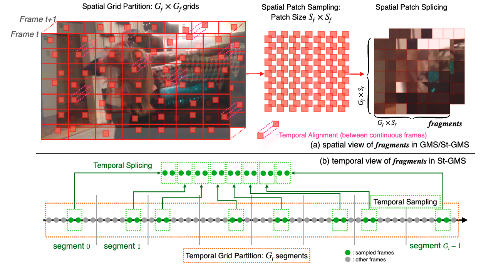

# FAST-VQA/FasterVQA

*📘We are holding an unofficial copy of the LSVQ dataset on huggingface [Link](https://huggingface.co/datasets/teowu/LSVQ-videos), which is necessary to reproduce training for FAST-VQA/FasterVQA. Please comply with the original [terms of use](https://github.com/baidut/PatchVQ#note) of this dataset, as we hold no responsibilities on any non-compliant usage.*


 [](https://github.com/QualityAssessment/FAST-VQA-and-FasterVQA) [](https://github.com/QualityAssessment/DOVER)

- 11 Sep, 2023: The extension (FasterVQA) is accepted by TPAMI 2023!
- 2 Dec, 2022: Upgraded the default inference script.
- 10 Nov, 2022: Release of the [ECVA official version](https://www.ecva.net/papers/eccv_2022/papers_ECCV/html/1225_ECCV_2022_paper.php), and our future work DOVER based on FAST-VQA with even better performance: [PDF](arxiv.org/pdf/2211.04894), [abstract](arxiv.org/abs/2211.04894), [GitHub](https://github.com/teowu/DOVER).
- 12 Oct, 2022: Release of pre-print FasterVQA paper: [PDF](arxiv.org/pdf/2210.05357), [Abstract](arxiv.org/abs/2210.05357).
- 27 Sep, 2022: Release of FasterVQA models: 4X more efficient, 14X real-time inference on Apple M1 CPU (for FasterVQA-MT, tested on my old Mac).
- 10 Sep, 2022: Support on Adaptive Multi-scale Inference (AMI): one model for different scales of inputs.

Performances for FasterVQA:

	
[](https://paperswithcode.com/sota/video-quality-assessment-on-konvid-1k?p=neighbourhood-representative-sampling-for)
	
[](https://paperswithcode.com/sota/video-quality-assessment-on-youtube-ugc?p=neighbourhood-representative-sampling-for)
	
[](https://paperswithcode.com/sota/video-quality-assessment-on-live-fb-lsvq?p=neighbourhood-representative-sampling-for)
	
[](https://paperswithcode.com/sota/video-quality-assessment-on-live-vqc?p=neighbourhood-representative-sampling-for)

Performances for FAST-VQA:

[](https://paperswithcode.com/sota/video-quality-assessment-on-konvid-1k?p=fast-vqa-efficient-end-to-end-video-quality)
	
[](https://paperswithcode.com/sota/video-quality-assessment-on-live-fb-lsvq?p=fast-vqa-efficient-end-to-end-video-quality)
	
[](https://paperswithcode.com/sota/video-quality-assessment-on-live-vqc?p=fast-vqa-efficient-end-to-end-video-quality)
	
[](https://paperswithcode.com/sota/video-quality-assessment-on-youtube-ugc?p=fast-vqa-efficient-end-to-end-video-quality)

An Open Source Deep End-to-End Video Quality Assessment Toolbox,

开源的端到端视频质量评价工具箱，

& Reproducible Code for ECCV2022 Paper [FAST-VQA: Efficient End-to-end Video Quality Assessment with Fragment Sampling](https://arxiv.org/abs/2207.02595v1) and its extension Paper [Neighbourhood Representative Sampling for Efficient End-to-end Video Quality Assessment](https://arxiv.org/abs/2210.05357).

暨 可复现 ECCV2022 论文 [FAST-VQA: Efficient End-to-end Video Quality Assessment with Fragment Sampling](https://arxiv.org/abs/2207.02595v1) 的代码。

:sparkles: We are officially announcing FasterVQA (named FAST-VQA-B-3D during development) which expands the proposed Fragments into a 3D version, which brings 4x faster speed and similar performance. The official CVF edition of ECCV paper will also be online soon as the conference is coming.

我们正式发布了新版的FasterVQA，在效率提升4倍的情况下保持接近原始FAST-VQA的性能。

In this release, we have refactored the training and testing code. The refactored code can achieve the same performance as the original version and allow modification of (1) the backbone structures; (2) the sampling hyper-parameters; (3) loss functions.

在这一版本中，我们对训练和测试的代码进行了重构。重构后的代码可以达到与原始版本相同的性能，并允许修改网络结构/采样的超参数/损失函数。





## [Upgraded] Infer for a single MP4 video

```
python vqa.py -m [MODEL_TYPE] -v [YOUR_INPUT_FILE_PATH]
```

`MODEL_TYPE` can be chosen in FasterVQA, FAST-VQA, and their efficient versions, FasterVQA-MS, FasterVQA-MT, FAST-VQA-M.

Outputs for default `python vqa.py` (inferring with FasterVQA) can be:

```
Inferring with model [FasterVQA]:
The quality score of the video (range [0,1]) is 0.42326.
```


Outputs for `python vqa.py -m FAST-VQA` (inferring with FAST-VQA) can be:

```
Inferring with model [FAST-VQA]:
The quality score of the video (range [0,1]) is 0.44953.
```

The result is now rescaled into between [0,1] with a sigmoid function.

<span style="color:red">Score near 0: extremely bad quality.</span>.

<span style="color:orange">Score 0.25: bad quality.</span>

<span style="color:yellow">Score 0.5: fair quality.</span>

<span style="color:#A5DF00"> Score 0.75: good quality.</span>

<span style="color:green">Score near 1.0: extremely good quality.</span>


## See our Weights & Biases training logs

我们在Wandb上公开了一部分训练和测试曲线。

We are reproducing several experiments and making public our training logs here.

[传送门/Gate to Curves](https://wandb.ai/timothyhwu/Open_FAST_VQA)

Now supports:
- FasterVQA-finetuned-to-KonViD-1k
- FasterVQA-on-MT-and-MS-scales-with-AMI


## :triangular_flag_on_post: Modularized Parts Designed for Development
为开发设计的模块化架构

### Data Preprocessing
数据预处理

Please view [Data Processing](./fastvqa/datasets/fusion_datasets.py) to see the source codes for data processing.
*Specially, look at the FusionDataset class and the get_spatial_and_temporal_samples function for our core transformations.*

#### Spatial Sampling
空间采样

We have supported spatial sampling approachs as follows:


- fragments
- resize
- arp_resize (resize while keeping the original Aspect Ratio)
- crop

We also support the combination of those sampling approaches (multi-branch networks) for more flexibility.

#### Temporal Sampling (New)
时域采样（新）

We also support different temporal sampling approaches:

- SampleFrames (sample continuous frames, imported from MMAction2)
- FragmentSampleFrames (:sparkles: New, sample fragment-like discontinuous frames)


### Network Structures
网络结构

#### Network Backbones
骨干网络

- Video Swin Transformer (with GRPB, as proposed in [FAST-VQA](https://arxiv.org/abs/2207.02595v1))
- Video Swin Transformer (vanilla)
- ConvNext-I3D (vanilla)

### Network Heads
网络头

- IP-NLR Head (as proposed in [FAST-VQA](https://arxiv.org/abs/2207.02595v1))

IP-NLR head can generate local quality maps for videos.

## Installation
安装

### Dependencies
依赖

The original library is build with

- python=3.8.8
- torch=1.10.2
- torchvision=0.11.3

while using decord module to read original videos (so that you don't need to make any transform on your original .mp4 input).

To get all the requirements, please run

```shell
pip install -r requirements.txt
```

### Direct Install
直接安装

You can run

```shell
git clone htps://github.com/QualityAssessment/FAST-VQA-and-FasterVQA.git
cd FAST-VQA-and-FasterVQA
pip install -e .
```

to install the full FAST-VQA with its requirements. The `-e` option allows you to import your customized version of the package.

## Usage
使用方法

### Quick Benchmark
快速测试


#### Step 1: Get Pretrained Weights

We supported pretrained weights for several versions:


| Name |  Pretrain   | Spatial Fragments | Temporal Fragments | PLCC@LSVQ_1080p | PLCC@LSVQ_test | PLCC@LIVE_VQC | PLCC@KoNViD | MACs | config | model |
| :---: | :---: | :---: | :---: | :---: | :---: | :---: | :---: | :---: | :---: | :---: |
|  FAST-VQA-B (ECCV2022) | Kinetics-400 |  7*32   |     1\*32\*(4)     |  0.814 |  0.877  |   0.844 | 0.855   |  279G  |  [config](options/fast/fast-b.yml)  | [github](https://github.com/TimothyHTimothy/FAST-VQA/releases/download/v2.0.0/FAST_VQA_B_1_4.pth) |
|  FasterVQA (:sparkles: New!) | Kinetics-400  |  7*32   |    8*4(*1)      |  0.811  |  0.874  | 0.837 | 0.864   |  69G |  [config](options/fast/f3dvqa-b.yml)   | [github](https://github.com/TimothyHTimothy/FAST-VQA/releases/download/v2.0.0/FAST_VQA_3D_1_1.pth) |
| - zero-shot transfer to MT scale with **AMI**  | Kinetics-400  |  7*32   |    4*4(*1)      |  0.791  |  0.860  | 0.826 | 0.849   |  35G |  [config](options/fast/fastervqa-mt.yml)   | Same as FasterVQA|
| - zero-shot transfer to MS scale with **AMI**  | Kinetics-400  |  5*32   |    8*4(*1)      |  0.798  |  0.849  | 0.818 | 0.854   |  36G |  [config](options/fast/fastervqa-ms.yml)   | Same as FasterVQA|
|  FAST-VQA-B-From-Scratch (:sparkles: New!) | None |  7*32   |     1*32*(4)     |  0.707 | 0.791 | 0.766 | 0.793   |  279G  |  [config](options/fast/fast-b.yml)  | [github](https://github.com/TimothyHTimothy/FAST-VQA/releases/download/v2.0.1/FAST_VQA_B_1_4_Scr.pth) |
|  FAST-VQA-B-3D-From-Scratch (:sparkles: New!) | None  |  7*32   |    8*4(*1)      | 0.685 | 0.760 | 0.739 | 0.773  |  69G |  [config](options/fast/f3dvqa-b.yml)   | [github](https://github.com/TimothyHTimothy/FAST-VQA/releases/download/v2.0.1/FAST_VQA_3D_1_1_Scr.pth) |
|  FAST-VQA-M (ECCV2022) | Kinetics-400  |  4*32  |     1\*32(\*4)     |  0.773  |  0.854  |  0.810 | 0.832  |  46G  |  [config](options/fast/fast-m.yml)   | [github](https://github.com/TimothyHTimothy/FAST-VQA/releases/download/v2.0.0/FAST_VQA_M_1_4.pth) |

#### Step 2: Download Corresponding Datasets

LSVQ: [Github](https://github.com/baidut/PatchVQ)
KoNViD-1k: [Official Site](http://database.mmsp-kn.de/konvid-1k-database.html)
LIVE-VQC: [Official Site](http://live.ece.utexas.edu/research/LIVEVQC/)

#### Step 3: Run the following one-line script!

```
python new_test.py -o [YOUR_OPTIONS]
```


### Training
训练

### Get Pretrained Weights from Recognition

You might need to download the original [Swin-T Weights](https://github.com/SwinTransformer/storage/releases/download/v1.0.4/swin_tiny_patch244_window877_kinetics400_1k.pth) to initialize the model.

### Train with large dataset (LSVQ)

To train FAST-VQA-B, please run

```
python new_train.py -o options/fast/fast-b.yml
```

To train FAST-VQA-M, please run

```
python new_train.py -o options/fast/fast-m.yml
```

To train FasterVQA (FAST-VQA-B-3D), please run

```
python new_train.py -o options/fast/f3dvqa-b.yml
```


### Finetune on small datasets with provided weights
在小规模数据集上进行调优


This training will split the dataset into 10 random train/test splits (with random seed 42) and report the best result on the random split of the test dataset. 

```shell
python split_train.py -opt [YOUR_OPTION_FILE] 
```

You may see option files in [Finetune Config Files](./options/finetune/).


Results for [FAST-VQA-B](./options/finetune/fast-b):


|       | KoNViD-1k | CVD2014 | LIVE-Qualcomm | LIVE-VQC | YouTube-UGC |
| ----  |    ----   |   ----  |      ----     |   ----   |    ----     |
| SROCC | 0.891 | 0.891 | 0.819 | 0.849 | 0.855 |
| PLCC  | 0.892 | 0.903 | 0.851 | 0.862 | 0.852 |


Results for [FasterVQA(FAST-VQA-B-3D)](./options/finetune/fast-3d):

|       | KoNViD-1k | CVD2014 | LIVE-Qualcomm | LIVE-VQC | YouTube-UGC |
| ----  |    ----   |   ----  |      ----     |   ----   |    ----     |
| SROCC | 0.895 | 0.896 | 0.826 | 0.843 | 0.863 |
| PLCC  | 0.898 | 0.904 | 0.843 | 0.858 | 0.859 |


Note that this part only support FAST-VQA-B and FAST-VQA-B-3D (FasterVQA); but you may build your own option files for other variants.

Supported datasets are KoNViD-1k, LIVE_VQC, CVD2014, LIVE-Qualcomm, YouTube-UGC.


## Citation

The following papers are to be cited in the bibliography if relevant papers are proposed.


```bibtex
@misc{wu2022fasterquality,
      title={Neighbourhood Representative Sampling for Efficient End-to-end Video Quality Assessment}, 
      author={Haoning Wu and Chaofeng Chen and Liang Liao and Jingwen Hou and Wenxiu Sun and Qiong Yan and Jinwei Gu and Weisi Lin},
      year={2022},
      eprint={2210.05357},
      archivePrefix={arXiv}
}

@article{wu2022fastquality,
  title={FAST-VQA: Efficient End-to-end Video Quality Assessment with Fragment Sampling},
  author={Wu, Haoning and Chen, Chaofeng and Hou, Jingwen and Liao, Liang and Wang, Annan and Sun, Wenxiu and Yan, Qiong and Lin, Weisi},
  journal={Proceedings of European Conference of Computer Vision (ECCV)},
  year={2022}
}
```

And this code library if it is used.
```bibtex
@misc{end2endvideoqualitytool,
  title = {Open Source Deep End-to-End Video Quality Assessment Toolbox},
  author = {Wu, Haoning},
  year = {2022},
  url = {http://github.com/timothyhtimothy/fast-vqa}
}
```


