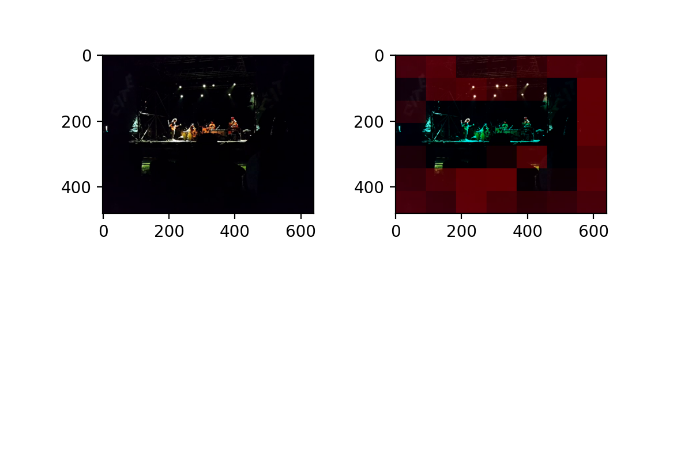

# FAST-VQA

The official open source inference code for future paper 'Learning Video Quality Assessment with Fragments Aligned Spatially and Temporally'.

## Future Ideas

- Distance-based Position Embedding (DBPE)
- Fractal Fragments (Fra^2^)
- Adaptive Fragment Selection (AFS)

## Demos




With the fragments, the proposed FAST-VQA can distinguish quality defects both on **Perceptually Unfavorable Content** and **Spatial-Temporal Technical Distortion** and robustly predicts the video quality across different VQA databases. It can also predict a video's quality with 0.02s, which is SUPER FAST comparing with traditional methods. 

See in [demos](./demos/) for more examples.

## Use STAFF-VQ

### Get Started

```shell
pip install -r requirements.txt
```

### Inference on VQA Datasets


```shell
python inference_dataset.py --dataset $DATASET$
```

Available datasets are LIVE_VQC, KoNViD, CVD2014, LSVQ.

### Inference on Videos (Not Yet Supported)

TBA.
