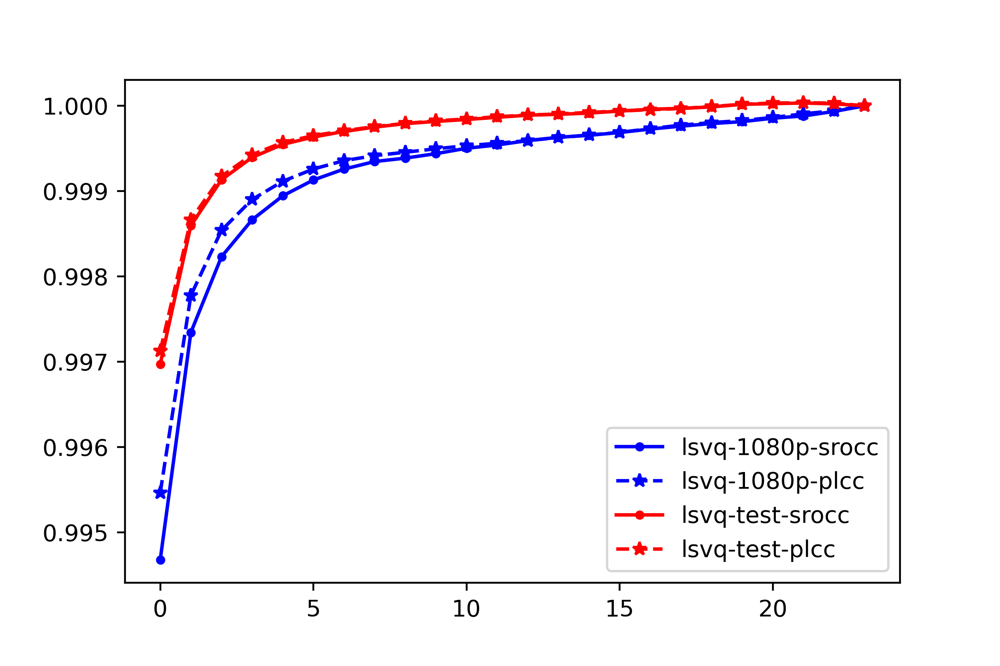

# FAST-VQA

Version: 0.6.0

The official open source training and inference code for future paper 'FAST-VQA: Efficient End-to-end Video Quality Assessment with Fragment Sampling'[Arxiv Edition](NA).

Fragments:
/fr_0.jpg)

Original Frames:
/vr_0.jpg)

You can also view the live fragment videos in [fragment demos](demo_fragments_with_originals_lsvq/9674_55.21_torch.Size([1080, 1920, 3])).


## Results

We reach SOTA performance with 210x reduced FLOPs. We also refresh the SOTA on multiple databases by a very large margin.


Our sparse and efficient sub-sampling also reaches at least 99.5% relative accuracy than extreme dense sampling.



See in [quality map demos](./demos/) for examples on local quality maps.


## Build FAST-VQA

### Requirements

The original method is build with

- python=3.8.8
- torch=1.10.2
- torchvision=0.11.3

while using decord module to read original videos (so that you don't need to make any transform on your original .mp4 input).

To get all the requirements, please run

```shell
pip install -r requirements.txt
```

Or directly run 

```shell
pip install .
```

to build the full FAST-VQA.

## Test FAST-VQA

### Visualize *fragments*

If you would like to visualize the proposed *fragments*, you can generate the demo visualizations by yourself, via the following script:


```shell
python visualize.py -d $DATASET$ 
```


### Inference on Scripts

You can install this directory by running

```shell
pip install .
```

And download the pretrained weights from [GDrive](pretrained_weights/README.md) and put them into `/pretrained_weights`.

Then you can embed these lines into your python scripts:

```python
from fastvqa import deep_end_to_end_vqa

video = torch.randn((3,96,224,224))
vq_evaluator = deep_end_to_end_vqa(pretrained=True, pretrained_path='pretrained_weights/fast_vqa_v0_3.pth')
score = vq_evaluator(video)
print(score)
```

### Benchmarking FAST-VQA

You can directly benchmark the model with mainstream benchmark VQA datasets.

```shell
python inference.py -d $DATASET$
```

Available datasets are LIVE_VQC, KoNViD, (experimental: CVD2014, YouTubeUGC), LSVQ (or 'all' if you want to infer all of them).


## Train FAST-VQA


### Train from scratch

You might need to download the original [Swin-T Weights](https://github.com/SwinTransformer/storage/releases/download/v1.0.4/swin_tiny_patch244_window877_kinetics400_1k.pth) to initialize the model.


#### Intra Dataset Training

This training will split the dataset into 10 random train/test splits (with random seed 42) and report the best result on the random split of the test dataset. 

```shell
python inference.py -d $DATASET$ --from_ar
```

Supported datasets are KoNViD-1k, LIVE_VQC, CVD2014, YouTube-UGC.

#### Cross Dataset Training

This training will do no split and directly report the best result on the provided validation dataset.

```shell
python inference.py -d $TRAINSET$-$VALSET$ --from_ar -lep 0 -ep 30
```

Supported TRAINSET is LSVQ, and VALSETS can be LSVQ(LSVQ-test+LSVQ-1080p), KoNViD, LIVE_VQC.


### Finetune with provided weights

#### Intra Dataset Training

This training will split the dataset into 10 random train/test splits (with random seed 42) and report the best result on the random split of the test dataset. 

```shell
python inference.py -d $DATASET$ --from_ar
```

Supported datasets are KoNViD-1k, LIVE_VQC, CVD2014, YouTube-UGC.

## Using FASTER-VQA

You can add the argument `-m FASTER` in any scripts above to switch to FASTER-VQA instead of FAST-VQA.

## Citation

Please cite the following paper when using this repo.

```
@article{wu2022fastquality,
  title={FAST-VQA: Efficient End-to-end Video Quality Assessment with Fragment Sub-sampling},
  author={Wu, Haoning and Chen, Chaofeng and Hou, Jingwen and Wang, Annan and Sun, Wenxiu and Yan, Qiong and Weisi, Lin},
  journal={arXiv preprint},
  year={2022}
}
```